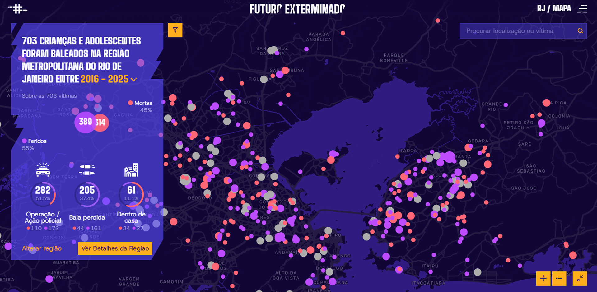

# Fogo Cruzado | Futuro Exterminado



> O impacto da violência armada contra crianças e adolescentes em uma plataforma de dados e memória.

### 🔗 Links rápidos
- [Site](https://futuroexterminado.com.br/)
- [Fogo Cruzado](https://fogocruzado.org.br/)

---

## Futuro Exterminado agora é Open Source

O Futuro Exterminado é um projeto **open source** que cria uma interface interativa para visualização dos dados sobre crianças e adolescentes vítimas da violência armada, atráves dos dados do Instituto Fogo Cruzado. Esse projeto pode ser adaptado para diferentes fontes de dados e casos de uso.

---

## Tecnologias utilizadas

- **[Nuxt 3](https://nuxt.com/)** - Framework Vue.js moderno
- **[Vue 3](https://vuejs.org/)** - Reactive framework
- **[Tailwind CSS](https://tailwindcss.com/)** - Utility-first CSS
- **[Mapbox GL](https://docs.mapbox.com/mapbox-gl-js/)** - Mapas interativos
- **[Node.js](https://nodejs.org/)** - Runtime para scripts
- **[Splide](https://splidejs.com/)** - Carrossel de imagens

---

## 📁 Estrutura do Projeto

```
├── assets/                     # Imagens, fontes e CSS
│   ├── css/                    # Estilos globais
│   ├── icons/                  # Ícones SVG
│   └── images/                 # Imagens estáticas
├── components/                 # Componentes Vue reutilizáveis
│   ├── Chart/                  # Gráficos e visualizações
│   ├── Feature/                # Componentes de features principais
│   ├── Layout/                 # Layout e navegação
│   ├── map/                    # Componentes de mapa
│   └── Ui/                     # Componentes de UI base
├── composables/                # Composables (lógica reativa)
├── data/                       # Arquivos de configuração
├── layouts/                    # Layouts da aplicação
├── pages/                      # Rotas da aplicação
├── plugins/                    # Plugins Nuxt
├── public/                     # Arquivos estáticos públicos
│   └── fogo-cruzado.json       # Dados (gerado pelo script)
├── server/                     # API routes e endpoints
├── utils/
│   └── scripts/                # Scripts de coleta e processamento
└── nuxt.config.ts              # Configuração principal do Nuxt
```

---

## Como começar

### Pré-requisitos

- **Node.js** ≥ 20
- **npm** ou **yarn**
- Git

### Instalação

1. Clone o repositório:

```bash
git clone https://github.com/fogocruzadoapp/futuro-exterminado.git
cd futuro-exterminado
```

2. Instale as dependências:

```bash
npm install
```

3. Crie o arquivo `.env` a partir do template:

```bash
cp .env.example .env
```

4. Configure as variáveis de ambiente (veja [Configuração](#-configuração))

---

## Configuração

### Variáveis de Ambiente

O projeto utiliza variáveis de ambiente para configuração. Todas as variáveis disponíveis estão documentadas em `.env.example`.

**Variáveis obrigatórias:**
- `FC_EMAIL` - Email para autenticação na API do Instituto Fogo Cruzado
- `FC_PASSWORD` - Senha para autenticação na API do Instituto Fogo Cruzado
- `VICTIMS_TOKEN` - Token de acesso para API detalhada

**Variáveis opcionais:**
- `NUXT_PUBLIC_MAPBOX_ACCESS_TOKEN` - Token do Mapbox (seu próprio token recomendado)
- `NUXT_APP_BASE_URL` - Base URL da aplicação (padrão: `/`)
- `SMTP_*` - Configurações SMTP para formulário de contato

Para mais detalhes, consulte `.env.example`.

---

## Gerenciando dados

### Obtendo dados de uma API externa

O projeto inclui um script para buscar dados de uma API externa e salvá-los localmente:

```bash
# Configure as credenciais no .env
# Depois execute:
node utils/scripts/coletar.mjs
```

Este script:
- Autentica na API
- Coleta dados de múltiplas fontes
- Valida e processa os dados
- Salva em `public/fogo-cruzado.json`

**Para usar com sua própria API:**

Edite `utils/scripts/coletar.mjs` e adapte:
1. A URL da API (`BASE_URL`)
2. Os endpoints necessários
3. A estrutura de autenticação
4. O processamento de dados
5. A estrutura do JSON final

---

## Desenvolvimento

### Executar localmente

```bash
npm run dev
```

Acesse `http://localhost:3000`

### Estrutura de componentes

- **`components/`** - Todos os componentes Vue reutilizáveis
- **`composables/`** - Lógica reativa compartilhada
- **`pages/`** - Rotas automáticas (arquivo-baseado)
- **`server/`** - API routes internas

Para adicionar novas páginas, crie arquivos em `pages/`. Para novos componentes, adicione em `components/`.

### Personalizando

**Layout:**
- `layouts/default.vue` - Layout principal
- `app.vue` - App root component

**Estilo:**
- `assets/css/` - Estilos globais
- `tailwind.config.js` - Configuração Tailwind

**Configurações gerais:**
- `data/config.json` - Opções de features
- `nuxt.config.ts` - Configuração Nuxt

---

## Build e Deploy

### Build estática (SSG)

Perfeita para hospedagem estática (GitHub Pages, Vercel, Netlify):

```bash
npm run generate
```

Cria arquivos em `.output/public/`

### Build com SSR

Para ambiente com Node.js:

```bash
npm run build
npm run preview
```

---

## Deploy em produção

### Vercel (recomendado)

1. Faça push para a branch `prod`
2. Adicione variáveis de ambiente no painel do Vercel
3. O deploy é automático

### GitHub Pages

```bash
npm run generate
# Envie os arquivos do ./build para gh-pages branch
```

### Servidor personalizado

Adapte o `vercel.json` ou crie seu próprio deploy script.

---

## Segurança

### Antes de abrir em público

- [ ] Nunca commit `.env` com credenciais reais
- [ ] Use apenas `.env.example` como template
- [ ] Configure secrets no CI/CD (GitHub Actions, Vercel, etc)
- [ ] Proteja as branches de produção
- [ ] Revise dados sensíveis antes do deploy

### Credentials e Secrets

Todos os dados sensíveis usam variáveis de ambiente:
- Credenciais de API
- Tokens de acesso
- Chaves SMTP
- Keys de terceiros

Nunca são commitados no repositório.

---

## Contribuindo

Contribuições são bem-vindas! Para contribuir:

1. Faça um fork do projeto
2. Crie uma branch para sua feature (`git checkout -b feature/nova-feature`)
3. Commit suas mudanças (`git commit -am 'Add: nova feature'`)
4. Push para a branch (`git push origin feature/nova-feature`)
5. Abra um Pull Request

Por favor, mantenha a qualidade do código e adicione testes quando possível.

---

## Licença

Este projeto está licenciado sob a **MIT License** - veja o arquivo [LICENSE](LICENSE) para detalhes.

---

## Suporte

- Issues e bugs: Use [GitHub Issues](https://github.com/fogocruzadoapp/futuro-exterminado/issues)
-  Discussões: Use [GitHub Discussions](https://github.com/fogocruzadoapp/futuro-exterminado/discussions)
-  Site: [Fogo Cruzado](https://fogocruzado.org.br/)

---

## Dados do Projeto

### Estrutura esperada de dados

O projeto espera dados em formato JSON com estrutura similar a:

```json
[
  {
    "id": "123",
    "date": "2024-01-15",
    "state": "Rio de Janeiro",
    "city": "Rio de Janeiro",
    "neighborhood": "Bairro",
    "latitude": -23.5505,
    "longitude": -46.6333,
    "victims": [
      {
        "id": "v1",
        "name": "Nome da Vítima",
        "age": 25,
        "ageGroup": { "name": "Jovem Adulto" },
        "situation": "Dead"
      }
    ]
  }
]
```

Você pode adaptar o script `utils/scripts/coletar.mjs` para sua própria estrutura de dados.

---

## Créditos

Desenvolvido pelo [Fogo Cruzado](https://fogocruzado.org.br/) em parceria com a [Café] (https://cafe.art.br/).

---

> **Nota:** Este é um projeto open source reutilizável. Sinta-se livre para adaptá-lo para seus próprios dados e necessidades!
